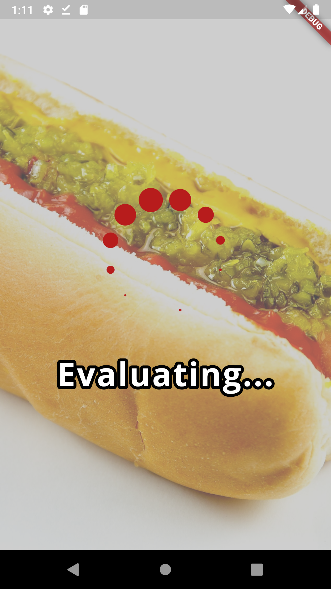
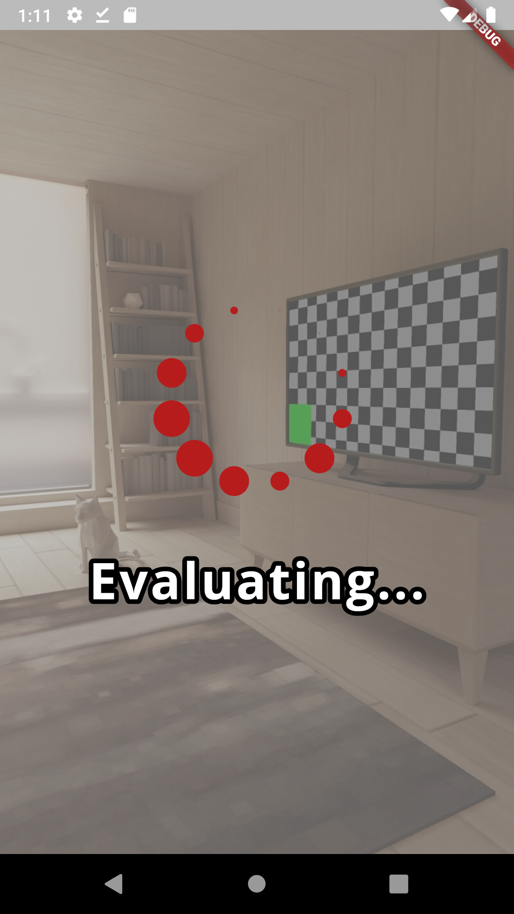
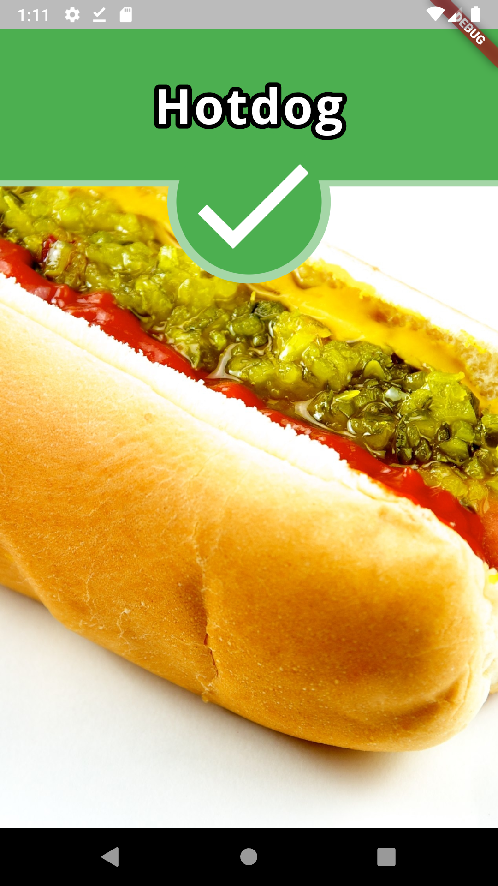
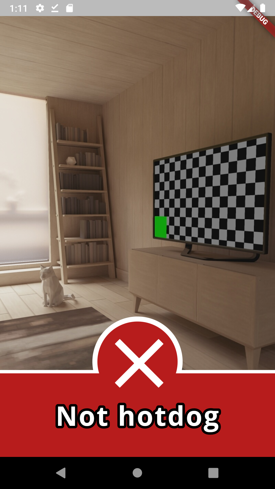

# SeeFood - "The Shazam for Food"

`What would you say if I told tou there is an app on the market...`

A close representation of Jian-Yang's SeeFood app, which was featured in the TV series [Silicon Valley](<https://en.wikipedia.org/wiki/Silicon_Valley_(TV_series)>), written in Dart and Flutter.
Take or choose a picture and the app will tell you whether it depicts a hotdog or not.
The app uses [Firebase's on-device image labeler](https://firebase.google.com/docs/ml-kit/label-images) to assert the content of every picture. Works offline too.

_Hint: long press the red action button to select a picture from gallery._

## Screenshots

|             Menu             |            Hotdog            |          Not hotdog          |
| :--------------------------: | :--------------------------: | :--------------------------: |
|  |  |  |
|  |  |  |

## Usage

In order to compile and use the app for your own, a Firebase project is required. Create a new project and link it with the app by following the setup instructions when adding an Android/iOS application to a Firebase project (e.g. Android requires downloading the respective google-services.json file).

## Acknowledgements

- Thank you to jogboms for his awesome [collection](https://github.com/jogboms/flutter_spinkit) of various loading indicators.
- Food pictures where taken from pexels&#46;com [[1](https://www.pexels.com/photo/close-up-photo-of-burger-1639562/)], [[2](https://www.pexels.com/photo/grilled-salmon-fish-on-rectangular-black-ceramic-plate-842142/)], [[3](https://www.pexels.com/photo/clean-eating-cuisine-delicious-dinner-1152237/)]. All credits go to their respective owners.
